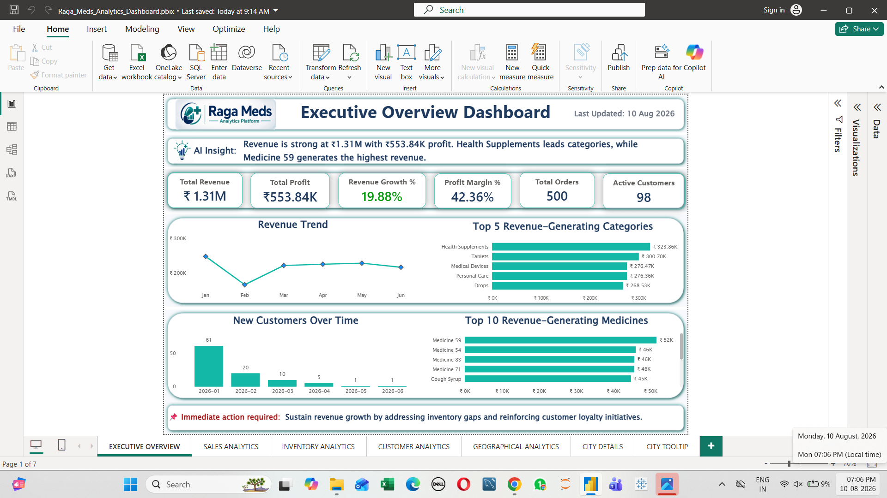
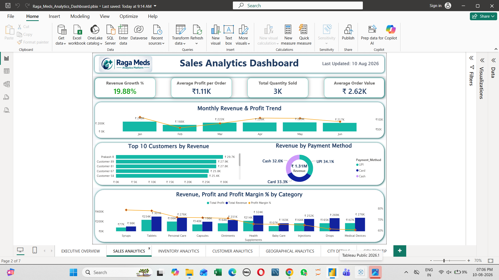
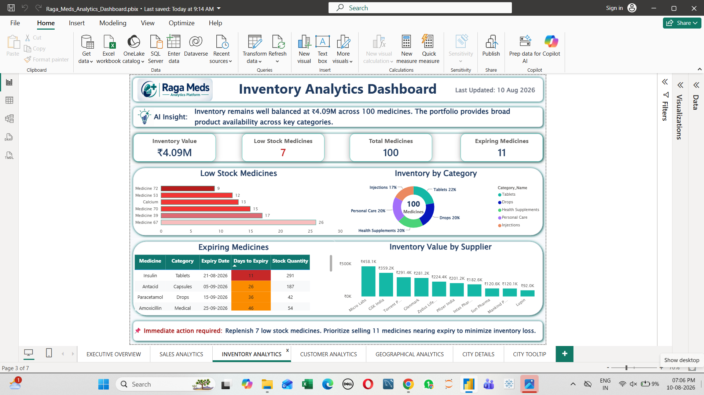
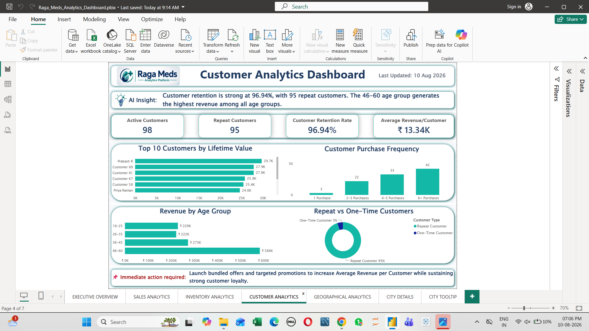
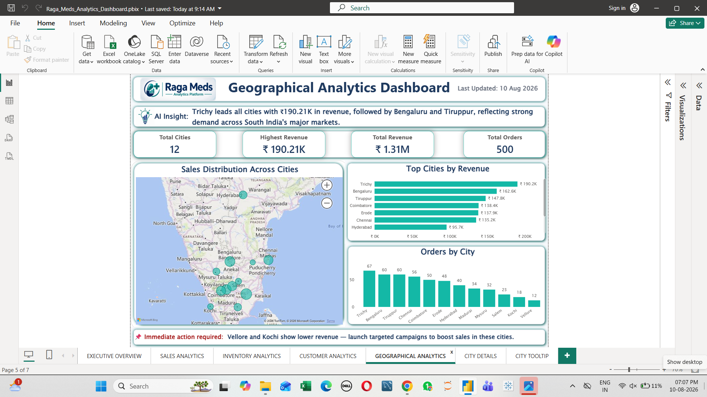
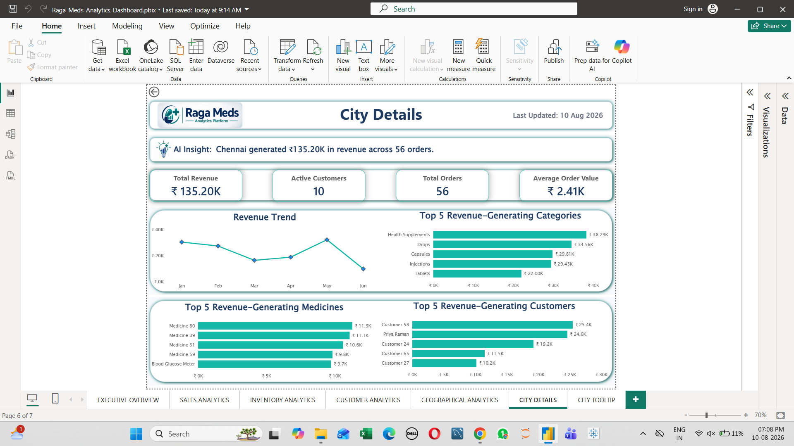
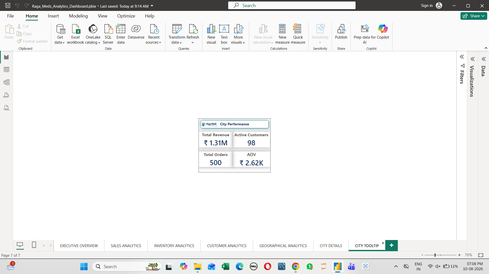

# 💊 Raga Meds Analytics Platform

An end-to-end **pharmacy retail analytics platform** designed to transform transactional healthcare data into actionable business insights.

The project combines **MySQL, SQL, Power BI, and DAX** to analyze sales, profitability, customers, inventory, suppliers, purchases, and geographical performance.

---

## 📌 Project Overview

The **Raga Meds Analytics Platform** is a business intelligence solution designed for pharmacy retail businesses.

Pharmacy businesses generate large volumes of sales, customer, inventory, supplier, and purchase data. Without centralized analytics, it can be difficult to identify profitable medicines, monitor stock availability, understand customer behavior, evaluate supplier contribution, and identify operational risks.

This project transforms relational pharmacy data into a structured analytics solution through the following workflow:

**MySQL Database → SQL Analysis → Data Modeling → DAX Measures → Power BI Dashboard → Business Insights**

The project demonstrates practical skills relevant to **Data Analyst, Business Intelligence Analyst, and Analytics roles**.

---

# 🎯 Business Objectives

The platform is designed to:

* Monitor overall revenue and profitability
* Analyze sales and order performance
* Identify top-performing medicines and categories
* Monitor inventory health
* Identify low-stock medicines
* Track medicines approaching expiry
* Analyze customer retention and purchasing behavior
* Identify high-value customers
* Evaluate geographical sales performance
* Analyze supplier and purchase performance
* Generate executive business KPIs
* Support data-driven business decisions

---

# 🗄️ Database

**Database:** `Raga_Meds_Analytics`

**Total Tables:** **9**

| # | Table            |
| - | ---------------- |
| 1 | Customers        |
| 2 | Categories       |
| 3 | Medicines        |
| 4 | Inventory        |
| 5 | Sales            |
| 6 | Sale_Details     |
| 7 | Suppliers        |
| 8 | Purchases        |
| 9 | Purchase_Details |

The database follows a relational structure connecting customers, sales, medicines, inventory, suppliers, and purchases.

---

# 📊 Power BI Dashboard

The completed Power BI report contains **7 analytical views** designed to provide both executive-level and detailed operational insights.

---

## 1. 📈 Executive Overview

Provides a high-level summary of overall pharmacy business performance.

### Key Metrics

* Total Revenue
* Total Profit
* Revenue Growth %
* Profit Margin %
* Total Orders
* Active Customers

### Key Analysis

* Revenue Trend
* Revenue by Category
* Top Revenue-Generating Medicines
* New Customers Over Time
* AI-Style Business Insight
* Immediate Business Action

---

## 2. 💰 Sales Analytics

Provides detailed analysis of sales performance and profitability.

### Key Metrics

* Revenue Growth %
* Average Profit per Order
* Total Quantity Sold
* Average Order Value

### Key Analysis

* Monthly Revenue & Profit Trend
* Top Customers by Revenue
* Revenue by Payment Method
* Revenue, Profit & Profit Margin by Category
* Sales Performance Analysis

---

## 3. 📦 Inventory Analytics

Monitors inventory health and identifies operational risks.

### Key Metrics

* Inventory Value
* Low Stock Medicines
* Total Medicines
* Expiring Medicines

### Key Analysis

* Inventory by Category
* Low Stock Analysis
* Expiring Medicines
* Inventory Value by Supplier
* Stock Monitoring
* AI-Style Business Insight
* Immediate Business Action

---

## 4. 👥 Customer Analytics

Analyzes customer behavior, retention, and purchasing patterns.

### Key Metrics

* Customer Retention %
* Repeat Customers
* Average Customer Value
* Highest Customer Lifetime Value

### Key Analysis

* Top Customers by Lifetime Value
* Customer Purchase Frequency
* Revenue by Age Group
* Repeat vs One-Time Customers
* Customer Retention Analysis
* AI-Style Business Insight
* Immediate Business Action

---

## 5. 🗺️ Geographical Analytics

Analyzes pharmacy business performance across cities.

### Key Analysis

* Revenue by City
* Orders by City
* Top Cities by Revenue
* Geographical Performance Map
* City-Level AI-Style Insight
* Immediate Business Action

The page supports interactive geographical analysis and city-level exploration.

---

## 6. 🏙️ City Details

A dedicated **drill-through page** providing detailed analysis for a selected city.

### Key Metrics

* Total Revenue
* Active Customers
* Total Orders
* Average Order Value

### Key Analysis

* City Revenue Trend
* Top Revenue-Generating Categories
* Top Revenue-Generating Medicines
* Top Revenue-Generating Customers
* City-Specific AI-Style Insight

---

## 7. 💡 City Tooltip

A compact **report-page tooltip** designed to provide additional city-level context while interacting with geographical visuals.

### Displays

* Revenue
* Active Customers
* Orders
* Average Order Value

This allows users to view additional city information without leaving the main geographical analysis page.

---

# 🖼️ Dashboard Preview

The Power BI report contains seven interactive analytical views covering executive performance, sales, inventory, customer behavior, geographical performance, and city-level analysis.

### 📈 Executive Overview



### 💰 Sales Analytics



### 📦 Inventory Analytics



### 👥 Customer Analytics



### 🗺️ Geographical Analytics



### 🏙️ City Details



### 💡 City Tooltip



> **Power BI Report:** `PowerBI/Raga_Meds_Analytics_Dashboard.pbix`
>
> The `.pbix` file can be downloaded from the repository and opened using **Power BI Desktop**.

---

# 🤖 AI-Style Business Insights

The dashboard includes dedicated **AI Insight** and **Immediate Action** sections.

### 💡 AI Insight

Provides concise, data-driven summaries based on dashboard metrics to help users understand important business patterns.

### 📌 Immediate Action

Converts analytical findings into practical business actions and highlights areas requiring management attention.

The design separates:

**What the data tells us → What the business should do next**

> **Note:** These are currently implemented as **DAX-driven AI-style insights**, not a Generative AI system. A dedicated Generative AI assistant is planned as a future enhancement.

---

# 🧮 DAX & Power BI

Key DAX concepts implemented include:

* Measures
* `SUM`
* `SUMX`
* `CALCULATE`
* `FILTER`
* `RELATED`
* `FORMAT`
* `TOPN`
* `MAXX`
* Time-based calculations
* Profit calculations
* Revenue calculations
* Customer metrics
* Inventory metrics
* Dynamic AI-style insight measures

### Power BI Features

* Interactive slicers
* Data modeling
* Drill-through
* Report-page tooltips
* Data-driven formatting
* Interactive dashboard navigation
* KPI cards
* Business intelligence visualizations

---

# 🛠️ SQL Analysis

The project includes modular SQL scripts covering different areas of pharmacy business analytics.

### SQL Modules

| Script                       | Analysis                  |
| ---------------------------- | ------------------------- |
| `01_Create_Database.sql`     | Database creation         |
| `02_Create_Tables.sql`       | Relational table creation |
| `03_Data_Loading_Guide.sql`  | Data loading process      |
| `04_Executive_KPIs.sql`      | Executive KPI analysis    |
| `05_Customer_Analytics.sql`  | Customer analysis         |
| `06_Inventory_Analytics.sql` | Inventory analysis        |
| `07_Sales_Analytics.sql`     | Sales analysis            |
| `08_Purchase_Analytics.sql`  | Purchase analysis         |
| `09_Supplier_Analytics.sql`  | Supplier analysis         |

---

# 🧠 SQL Concepts Demonstrated

The SQL analysis demonstrates practical analytical SQL techniques including:

* `SELECT`
* `WHERE`
* `GROUP BY`
* `HAVING`
* `ORDER BY`
* `LIMIT`
* `INNER JOIN`
* Aggregate Functions
* `CASE`
* Subqueries
* CTEs
* Window Functions
* `DENSE_RANK()`
* `LAG()`
* Running Totals
* `COUNT(DISTINCT)`
* `NULLIF()`
* `ROUND()`
* Date Functions
* Ranking Analysis
* Trend Analysis

---

# 📊 Business Insights

The analytics platform helps identify:

* Top-performing medicines
* Highest-revenue categories
* High-value customers
* Customer retention patterns
* Low-stock medicines
* Medicines approaching expiry
* High-performing cities
* Lower-performing markets
* Revenue concentration
* Supplier contribution
* Purchase trends
* Profitability patterns

These insights can support decisions related to:

* Inventory replenishment
* Medicine purchasing
* Customer retention
* Supplier evaluation
* Sales strategy
* Product performance
* Geographic expansion
* Operational planning

---

# 🛠️ Technologies Used

### Currently Implemented

* **MySQL**
* **SQL**
* **Power BI**
* **DAX**
* **Git**
* **GitHub**

### Planned Enhancements

* Python
* Pandas
* NumPy
* Matplotlib
* Exploratory Data Analysis
* Machine Learning
* Streamlit
* Generative AI

---

# 📁 Project Structure

```text
Raga_Meds_Analytics_Platform/
│
├── README.md
│
├── Documentation/
│   ├── 01_Project_Overview.md
│   ├── 02_Database_Schema.md
│   ├── 03_SQL_Query_Summary.md
│   └── 04_Project_Insights.md
│
├── PowerBI/
│   └── Raga_Meds_Analytics_Dashboard.pbix
│
├── SQL/
│   ├── 01_Create_Database.sql
│   ├── 02_Create_Tables.sql
│   ├── 03_Data_Loading_Guide.sql
│   ├── 04_Executive_KPIs.sql
│   ├── 05_Customer_Analytics.sql
│   ├── 06_Inventory_Analytics.sql
│   ├── 07_Sales_Analytics.sql
│   ├── 08_Purchase_Analytics.sql
│   └── 09_Supplier_Analytics.sql
│
└── Screenshots/
    ├── Executive_Overview.png
    ├── Sales_Analytics.png
    ├── Inventory_Analytics.png
    ├── Customer_Analytics.png
    ├── Geographical_Analytics.png
    ├── City_Details.png
    └── City_Tooltip.png
```

---

# 🚀 Future Enhancements

The next development phase will extend the platform beyond descriptive and business intelligence analytics.

## 🐍 Python EDA

Planned Python analysis includes:

* Data cleaning
* Exploratory Data Analysis
* Statistical analysis
* Visualization
* Business pattern discovery

## 🤖 Machine Learning

Potential applications include:

* Medicine demand forecasting
* Inventory prediction
* Sales forecasting
* Customer segmentation
* Expiry-risk analysis

## 🌐 Streamlit

A future interactive web application will combine:

**SQL + Python + Machine Learning + Business Analytics**

## ✨ Generative AI

A future business-focused AI assistant may be added to help users:

* Interpret business analytics
* Identify important trends
* Explain KPIs
* Generate actionable recommendations
* Support pharmacy management decisions

The goal is to add AI where it provides **real business value**, rather than creating a generic chatbot.

---

# 📌 Project Highlights

* ✅ End-to-End Pharmacy Retail Analytics Project
* ✅ 9 Relational Database Tables
* ✅ Modular SQL Analytics
* ✅ Advanced SQL Window Functions
* ✅ Power BI Dashboard
* ✅ 7 Analytical Dashboard Views
* ✅ DAX Measures
* ✅ Executive KPI Analysis
* ✅ Customer Analytics
* ✅ Inventory Analytics
* ✅ Sales Analytics
* ✅ Supplier & Purchase Analytics
* ✅ Geographical Analysis
* ✅ City-Level Drill-Through
* ✅ Interactive Report-Page Tooltip
* ✅ DAX-Driven AI-Style Business Insights
* ✅ Immediate Business Actions
* ✅ GitHub Documentation
* ✅ Dashboard Screenshots
* ✅ Downloadable Power BI Report

---

# 🎓 Skills Demonstrated

* SQL
* MySQL
* Database Design
* Data Modeling
* Power BI
* DAX
* Business Intelligence
* Healthcare Analytics
* Data Analysis
* Analytical Problem Solving
* Dashboard Development
* Git & GitHub

---

# 👩‍💻 Developed By

**G. Gokul Shivani**

**Aspiring Data Analyst | SQL | Python | Power BI | Business Intelligence**

---

## ⭐ Project Goal

The long-term goal of the **Raga Meds Analytics Platform** is to evolve from a business intelligence solution into a complete **data-driven pharmacy analytics platform**.

The planned technology progression is:

**SQL → Power BI → Python → Machine Learning → Streamlit → Generative AI**

The ultimate objective is to combine business intelligence, predictive analytics, and business-focused AI to help pharmacy businesses make faster and more informed decisions.
